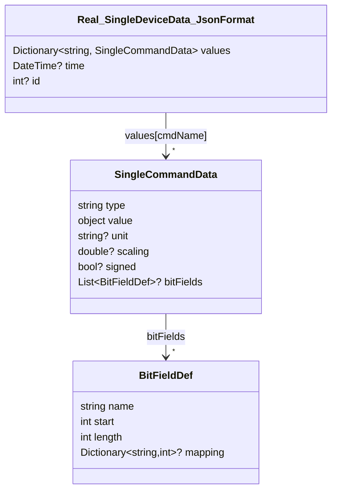
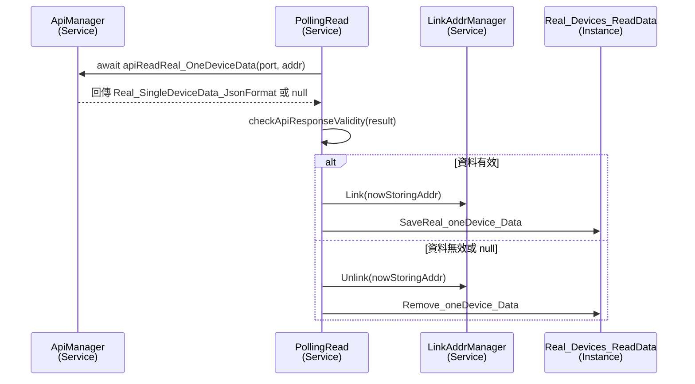

# Read Real Memory API 使用流程
> ReadRealMemory_API 在 "API使用文件中" 稱為 「單機狀態詢問」

以下以 `ApiManager.apiReadReal_OneDeviceData` 為例，說明從資料模型定義、API 呼叫實作，到服務端如何使用的完整流程。

---

## 1. 定義回傳資料模型

`apiReadReal_OneDeviceData` 回傳 `Real_SingleDeviceData_JsonFormat`，其結構定義於 `demoVer/Models/realTimeData.cs`。



- `Real_SingleDeviceData_JsonFormat.values` 以命令名稱為 key，對應該命令的即時值 (`SingleCommandData`)。
- `SingleCommandData.value` 可為數值、字串或陣列，依命令不同而異；若命令帶有位元欄位，`bitFields` 會提供對應的解析資料。
- `time`、`id` 由後端依設備紀錄資訊選擇性填入。

---

## 2. 在 ApiManager 中實作呼叫函式

`demoVer/Services/ApiProcessor.cs`

```csharp
public async Task<Real_SingleDeviceData_JsonFormat> apiReadReal_OneDeviceData(string type, uint addr)
{
    try
    {
        string url = $"api/memory/read-real?type={type}&addr={addr}";
        var result = await _http.GetFromJsonAsync<Real_SingleDeviceData_JsonFormat>(url);

        if(result == null)
        {
            throw new Exception($"[apiRead_OneDeviceData] ReadReal_API_Json == null");
        }
        return result;

    }
    catch (HttpRequestException ex)
    {
        AppLogger.Log_To_File_log(_category, $"[ApiManager][apiReadReal_OneDeviceData] Http_Error: {ex}", AppLogLevel.Debug);
        return null;
    }
    catch(Exception ex)
    {
        AppLogger.Log_To_File_log(_category, $"[ApiManager][apiReadReal_OneDeviceData] Error : {ex.Message}", AppLogLevel.Error);
        return null;
    }
}
```

- `type` 為 port 名稱（例如 `CAN1`、`MOD2`），`addr` 為 0~63 的裝置位址。
- 若 HTTP 或 JSON 反序列化失敗，函式會記錄 log 並回傳 `null`，呼叫端需負責後續處理。

---

## 3. 實際使用案例：PollingRead.PollOneStepAsync

`demoVer/Services/PollingRead.cs`

```csharp
var res = await _apiManager.apiReadReal_OneDeviceData(nowPollingPort, nowPollingAddr);

bool res_is_valid = checkApiResponseValidity(res);
if(res_is_valid is false)
{
    _linkAddrManager.Unlink(nowStoringAddr);
    _globalVar.Real_Devices_ReadData.Remove_oneDevice_Data(nowStoringAddr);
}
else
{
    _linkAddrManager.Link(nowStoringAddr);
    _globalVar.Real_Devices_ReadData.SaveReal_oneDevice_Data(nowStoringAddr, res);
}
```

- `PollingRead` 在輪詢到連線中的裝置時會呼叫 `apiReadReal_OneDeviceData`。
- 取得結果後透過 `checkApiResponseValidity` 檢查資料（例如確認 `MFR_MODEL` 是否存在）。
- 資料無效時，將該位址從 `LinkAddrManager` 以及 `_globalVar.Real_Devices_ReadData` 中移除；有效則更新連線狀態並儲存最新快照。

---

## 4. 呼叫流程摘要



此流程展示 `apiReadReal_OneDeviceData` 在輪詢架構中的角色：
1. 透過 `ApiManager` 包裝 HTTP 呼叫與錯誤處理；
2. 在 `PollingRead` 中呼叫 API，接續對資料進行驗證、狀態同步與快照儲存。
