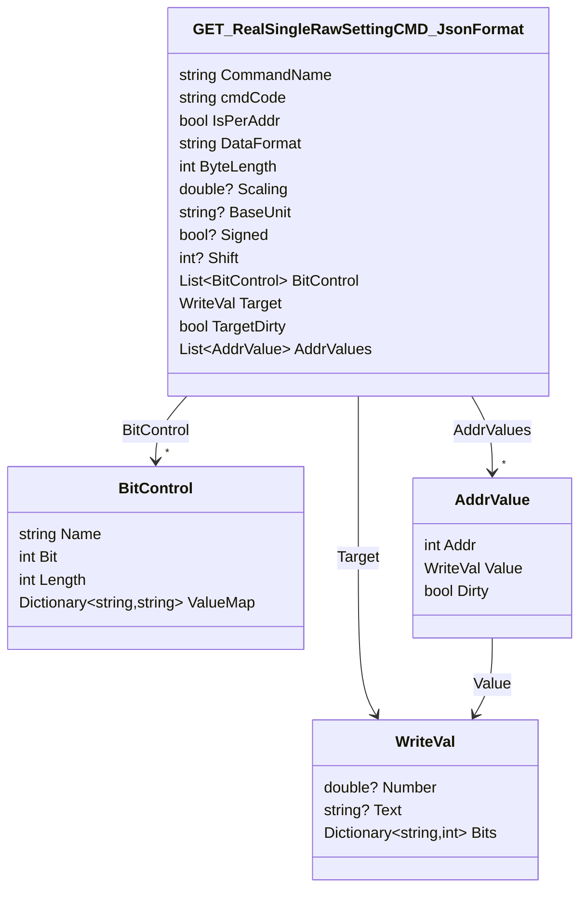
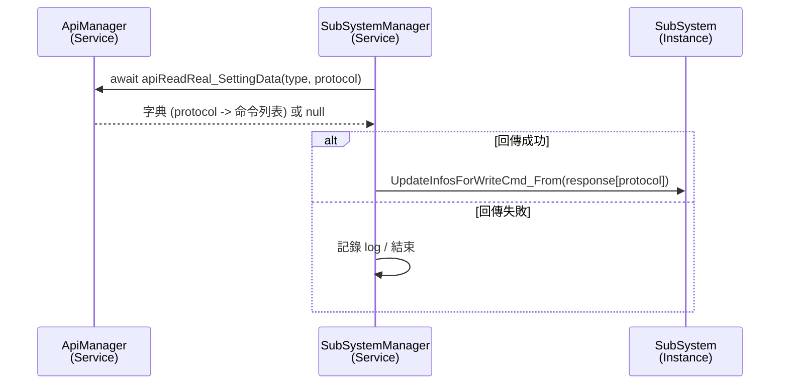

# Read Real Setting Data API 使用流程
> ReadRealSettingData_API 在 "API使用說明文件" 中稱為 「當前設定值」

以下以 `ApiManager.apiReadReal_SettingData` 為例，說明從資料模型定義、API 呼叫實作，到服務端如何使用的完整流程。

---

## 1. 定義回傳資料模型

`apiReadReal_SettingData` 回傳 `Dictionary<string, List<GET_RealSingleRawSettingCMD_JsonFormat>>`，其中 key 為 protocol。模型定義於 `demoVer/Models/WRITE_DEVICE_DATA/Real_SettingData.cs`。


- 範例：`commandName` (`CURVE_CC`) 對應的 `cmdCode` 是 `0x00B0`。
- 每個 `GET_RealSingleRawSettingCMD_JsonFormat` 表示一個可寫入命令的設定資訊：資料格式、Scalings、位元欄位定義、預設目標值等。
- 若 `IsPerAddr == true`，則 `AddrValues` 會列出各位址對應的值與是否已變更 (`Dirty`)；否則以 `Target` 表示全域目標值。

---

## 2. 在 ApiManager 中實作呼叫函式

`demoVer/Services/ApiProcessor.cs`

```csharp
public async Task<Dictionary<string, List<GET_RealSingleRawSettingCMD_JsonFormat>>> apiReadReal_SettingData(string type, string protocolFileName)
{
    try
    {
        if(string.IsNullOrEmpty(type))
        {
            AppLogger.Log_To_File_log(_category, $"[ApiManager][apiReadReal_SettingData] type is invalid", AppLogLevel.Trace);
            return null;
        }
        if(string.IsNullOrEmpty(protocolFileName))
        {
            AppLogger.Log_To_File_log(_category, $"[ApiManager][apiReadReal_SettingData] protocol is invalid", AppLogLevel.Trace);
            return null;
        }
        
        string url = $"api/memory/write-api?type={type}&protocol={protocolFileName}";
        var result = await _http.GetFromJsonAsync<Dictionary<string, List<GET_RealSingleRawSettingCMD_JsonFormat>>>(url);
        
        if(result == null)
        {
             throw new Exception($"[ApiManager][apiReadReal_SettingData] ReadReal_SettingData is null");
        }
        return result;
    }
    catch (HttpRequestException ex)
    {
        AppLogger.Log_To_File_log(_category, $"[ApiManager][apiReadReal_SettingData] Http_Error: {ex}", AppLogLevel.Debug);
        return null;
    }
    catch(Exception ex)
    {
        AppLogger.Log_To_File_log(_category, $"[ApiManager][apiReadReal_SettingData] Error : {ex.Message}", AppLogLevel.Error);
        return null;
    }
}
```
- `type` 與 `protocolFileName` 對應 port 與協定檔案，例如 `(CAN1, NTN-5K_CAN.json)`。
- API 回傳的字典以 `protocolFileName` 為 key 且只有這個 key `("NTN-5K_CAN.json")`；內層 `List` 儲存該協定所有命令的設定資訊。
- 函式針對空字串或 HTTP/JSON 失敗皆以 log 記錄並回傳 `null`。

---

## 3. 實際使用案例：SubSystemManager.UpdateSubSystem_WriteCmdInfo

`demoVer/Services/SubSystemManager.cs`

```csharp
var response = await _apiManager.apiReadReal_SettingData(port, protocol);

if (response is null)
{
    AppLogger.Log_To_File_log(_category,
        $"[SubSystemManager][UpdateSubSystem_WriteCmdInfo] response is null for Port:{port}, Protocol:{protocol}",
        AppLogLevel.Debug);
    return;
}

if (response[protocol] is null)
{
    AppLogger.Log_To_File_log(_category,
        $"[SubSystemManager][UpdateSubSystem_WriteCmdInfo] response[{protocol}] is null",
        AppLogLevel.Debug);
    return;
}

await subsys.UpdateInfosForWriteCmd_From(response[protocol]);
```

- 取得資料後，將特定 `protocol` 的命令列表交給 `SubSystem.UpdateInfosForWriteCmd_From`，更新可寫入命令的資訊。
- 若 API 回傳 `null` 或指定 key 不存在，僅記錄 log 並結束。

---

## 4. 呼叫流程摘要



此流程與其他 API 文件一致，強調三個步驟：
1. 建立對應資料模型 (`GET_RealSingleRawSettingCMD_JsonFormat`, `BitControl`, `WriteVal`, `AddrValue`)；
2. 在 `ApiManager` 實作 HTTP 呼叫與錯誤處理；
3. 在服務 (`SubSystemManager`) 中取回資料並更新系統狀態。

針對其他設定數據或寫命令相關 API，也可依此格式撰寫與擴充。
