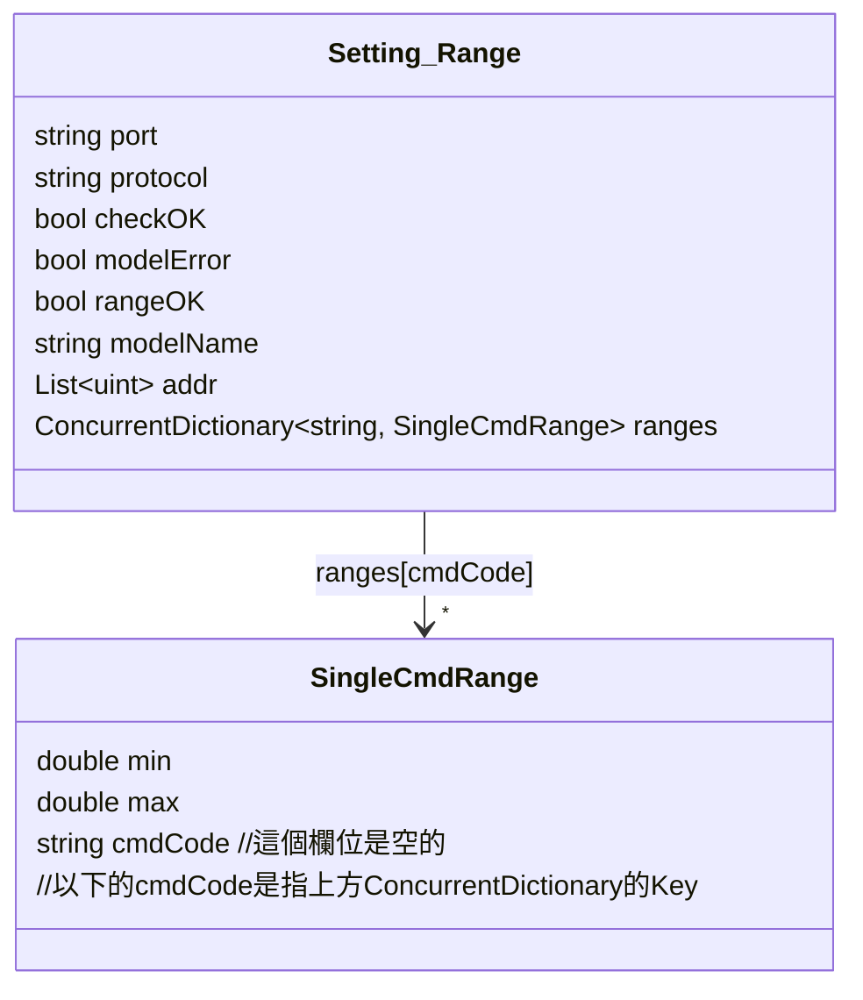
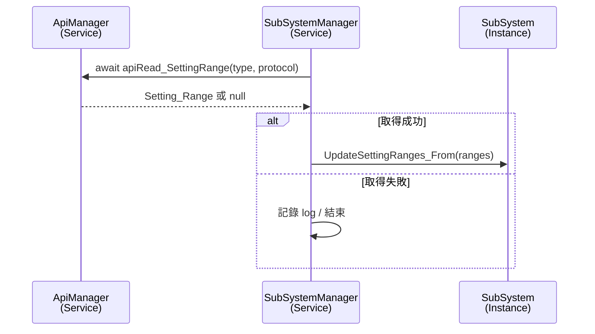

# Setting Range API 使用流程
> Setting_Range_API 在 "API使用說明文件" 中稱為「可設定範圍」

以下以 `ApiManager.apiRead_SettingRange` 為例，說明從資料模型定義、API 呼叫實作，到服務端如何使用的完整流程。

---

## 1. 定義回傳資料模型



- `Setting_Range` 對應 `/api/memory/partition-status` 回傳的 JSON 根節點。
  - `port` / `protocol` 為查詢目標的識別。
  - `addr` 列出分區內包含的位址；`checkOK`、`modelError`、`rangeOK` 為後端檢核結果。
  - 以 `cmdName` (`CURVE_CC`) 為例，對應的 `cmdCode` 是 `0x00B0`。
  - `ranges` 以命令代碼 (`cmdCode`) 為 key，對應每個可設定命令的上下限資訊。
- `SingleCmdRange` 表示單一命令的設定範圍，包含 `min`、`max` 與原始 `cmdCode`。

---

## 2. 在 ApiManager 中實作呼叫函式

`demoVer/Services/ApiProcessor.cs`

```csharp
public async Task<Setting_Range> apiRead_SettingRange(string type, string protocolFileName)
{
    try
    {
        string url = $"/api/memory/partition-status?type={type}&protocol={protocolFileName}";
        var result = await _http.GetFromJsonAsync<Setting_Range>(url);

        if(result == null)
        {
            throw new Exception($"[apiRead_SettingRange] Read_API_Json == null");
        }
        return result;

    }
    catch (HttpRequestException ex)
    {
        AppLogger.Log_To_File_log(_category, $"[ApiManager][apiRead_SettingRange] Http_Error: {ex}", AppLogLevel.Debug);
        return null;
    }
    catch(Exception ex)
    {
        AppLogger.Log_To_File_log(_category, $"[ApiManager][apiRead_SettingRange] Error : {ex.Message}", AppLogLevel.Error);
        return null;
    }
}
```

- 透過 `_http.GetFromJsonAsync<Setting_Range>` 將 JSON 反序列化為前述模型。
- `type` 與 `protocolFileName` 分別對應 port 與協定檔名，例如 `(CAN1, NTN-5K_CAN.json)`。
- 任何錯誤 (HTTP 或反序列化) 都會記錄 Log，並回傳 `null` 讓上層決定後續處理。

---

## 3. 實際使用案例：SubSystemManager.UpdateSubSystem_SettingRange

`demoVer/Services/SubSystemManager.cs`

```csharp
var response = await _apiManager.apiRead_SettingRange(port, protocol);
if (response is null)
{
    AppLogger.Log_To_File_log(_category,
        $"[SubSystemManager][UpdateSubSystem_SettingRange] response is null for Port:{port}, Protocol:{protocol}",
        AppLogLevel.Debug);
    return;
}

var rangesDict = response.ranges;
await subsys.UpdateSettingRanges_From(rangesDict);
```

- `SubSystemManager` 先確認欲更新的子系統存在，再呼叫 `apiRead_SettingRange`。
- 成功取得資料後，將 `Setting_Range.ranges` 傳給 `SubSystem.UpdateSettingRanges_From`，以 ConcurrentDictionary 的內容覆蓋本地紀錄。
- 若 API 回傳 `null`，僅記錄 log 並結束；實際重試策略由呼叫端掌握。

---

## 4. 呼叫流程摘要



此流程示範 API 使用的三個核心步驟：
1. 先建立對應資料模型 (`Setting_Range`, `SingleCmdRange`)；
2. 在 `ApiManager` 中包裝 HTTP 呼叫與錯誤處理；
3. 由服務 (`SubSystemManager`) 呼叫並更新內部狀態。

未來整合其他設定範圍或命令資訊的 API 時，可沿用此模式持續擴充。
