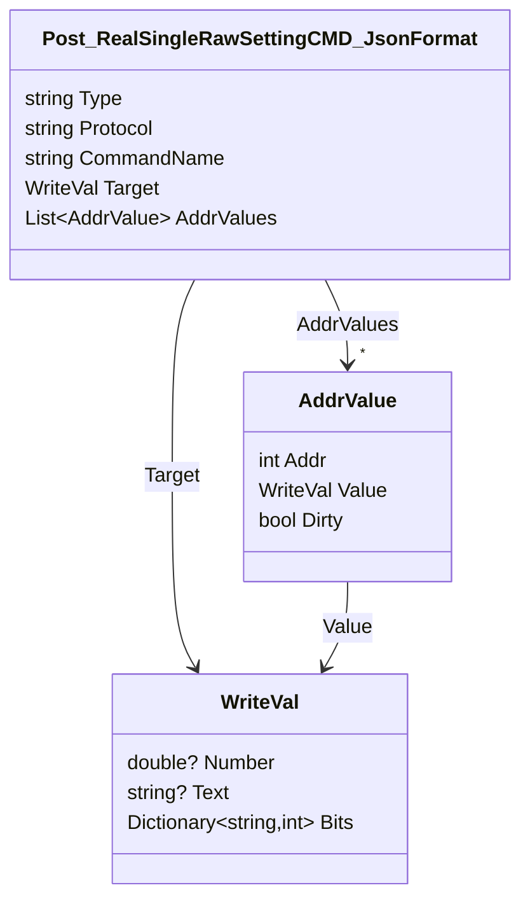
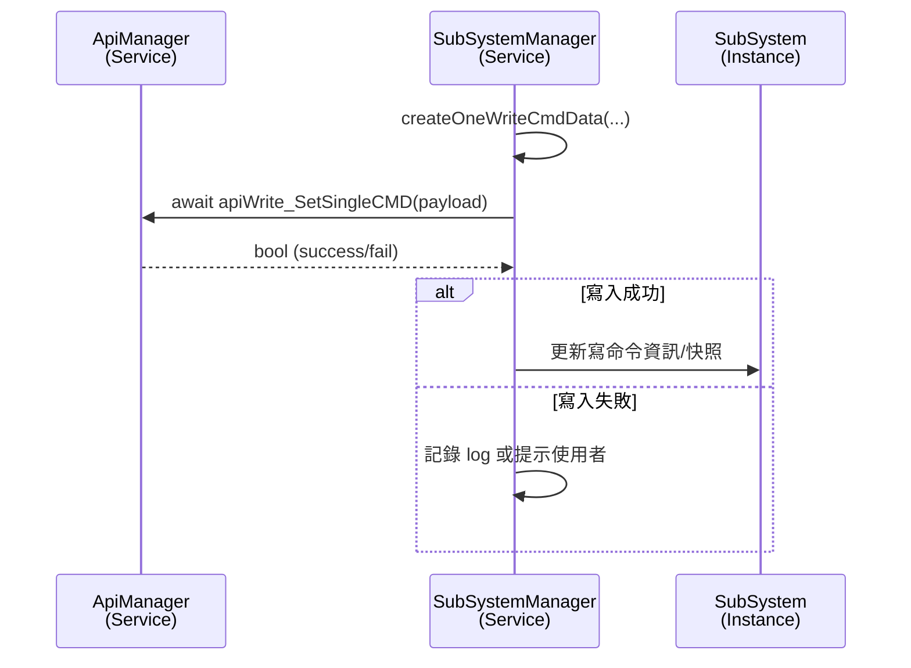

# Write Real Setting Data API 使用流程
> WriteRealSettingData_API 在 "API使用說明文件" 中稱為 「POST API」

以下以 `ApiManager.apiWrite_SetSingleCMD` 為例，說明從資料模型定義、API 呼叫實作，到服務端如何使用的完整流程。

---

## 1. 定義請求資料模型

`apiWrite_SetSingleCMD` 接受 `Post_RealSingleRawSettingCMD_JsonFormat` 作為 request body，定義於 `demoVer/Models/WRITE_DEVICE_DATA/Real_SettingData.cs`。


- `Type` 指定要寫入的 port (e.g. `CAN1`, `CAN2`, `MOD1`, `MOD2` 擇一)
- `Protocol` 指定要寫入的協定檔名 (e.g. `NTN-5K_CAN.json`, `NTN-5K_MOD.json` 擇一)
- `CommandName` 為目標命令名稱；若為每個 addr 各自設定，使用 `AddrValues`；否則以 `Target` 表示統一寫入的值。
- `WriteVal` 支援數值 (`Number`)、文字 (`Text`) 與位元欄位 (`Bits`) 三種型式。

---

## 2. 在 ApiManager 中實作呼叫函式

`demoVer/Services/ApiProcessor.cs`

```csharp
public async Task<bool> apiWrite_SetSingleCMD(Post_RealSingleRawSettingCMD_JsonFormat api_body, CancellationToken ct = default)
{
    try
    {
        //[Debug 僅用在本地python server 測試]
        var options = new JsonSerializerOptions
        {
            PropertyNamingPolicy = JsonNamingPolicy.CamelCase,
        };

        string url = $"api/memory/write-api";
        using var response = await _http.PostAsJsonAsync(url, api_body, options, ct);

        if (response.IsSuccessStatusCode)
        {
            AppLogger.Log_To_File_log(_category, $"[ApiManager][apiWrite_SetSingleCMD]成功: {(int)response.StatusCode}", AppLogLevel.Trace);
            return true;
        }
        else
        {
            var text = await response.Content.ReadAsStringAsync(ct);
            AppLogger.Log_To_File_log(_category, $"[ApiManager][apiWrite_SetSingleCMD]失敗: {(int)response.StatusCode}, Failed Message : {text}", AppLogLevel.Trace);
            return false;
        }
    }
    catch (HttpRequestException ex)
    {
        AppLogger.Log_To_File_log(_category, $"[ApiManager][apiWrite_SetSingleCMD] Http_Error: {ex}", AppLogLevel.Debug);
        return false;
    }
    catch (Exception ex)
    {
        AppLogger.Log_To_File_log(_category, $"[ApiManager][apiWrite_SetSingleCMD] Error : {ex.Message}", AppLogLevel.Error);
        return false;
    }
}
```

- 請求以 `POST api/memory/write-api` 送出，使用 `JsonNamingPolicy.CamelCase` 以符合後端需求。
- 成功/失敗會記錄 Response Code 及錯誤訊息；發生例外時回傳 `false`。

---

## 3. 實際使用案例：SubSystemManager.WriteCmdsToFramework

`demoVer/Services/SubSystemManager.cs`

```csharp
public async Task<bool> WriteCmdsToFramework(
    string port,
    string protocol,
    List<Post_RealSingleRawSettingCMD_JsonFormat> writeCmdData_List,
    int pageSelection)
{
    var subsys = GetOneSubSystem_Ref(port, protocol);
    if (subsys is null || writeCmdData_List.Count == 0)
    {
        return false;
    }

    var pageWriteLock = subsys.Get_WriteProcessFlowLock_By_PageSelection(pageSelection);
    if (pageWriteLock is null)
    {
        return false;
    }

    await pageWriteLock.WaitAsync();
    try
    {
        for (int attempt = 0; attempt < 2; attempt++)
        {
            foreach (var payload in writeCmdData_List)
            {
                var success = await _apiManager.apiWrite_SetSingleCMD(payload);
                await Task.Delay(30);
                if (!success)
                {
                    AppLogger.Log_To_File_log(_category,
                        $"[SubSystemManager][WriteCmdToFramework] Failed: {payload.CommandName}",
                        AppLogLevel.Warning);
                }
            }

            writeCmdData_List = await Is_CmdDatas_AlreadySetting(port, protocol, writeCmdData_List);
        }

        subsys.Update_WriteFailedCmdsList_By_PageSelection(pageSelection, writeCmdData_List);
        await UpdateSubSystem_WriteCmdInfo(port, protocol);
        return true;
    }
    finally
    {
        pageWriteLock.Release();
    }
}
```

- 入口會先檢查子系統存在與待寫命令是否為空，並依頁面取得對應鎖，確保同一子系統僅有一個寫入流程。
- 實際寫入會逐一呼叫 `apiWrite_SetSingleCMD`，中間穿插短暫延遲，避免瞬間打爆 Framework。
- 每輪寫入後透過 `Is_CmdDatas_AlreadySetting` 比對是否已成功生效，留下失敗命令並最多重試兩次。
- 結束時將失敗命令記錄於 `SubSystem`，並重新抓取 `apiReadReal_SettingData` 更新可寫命令資訊(例如`CURVE_CC`, `CURVE_CV`...)。

---

## 4. 呼叫流程摘要



流程與其他 API 文件一致，強調三個步驟：
1. 先定義請求模型 (`Post_RealSingleRawSettingCMD_JsonFormat`, `WriteVal`, `AddrValue`)；
2. 在 `ApiManager` 中包裝 `POST` 呼叫與錯誤處理；
3. 由服務 (`SubSystemManager`) 建立 payload、發送寫入並更新本地狀態。
