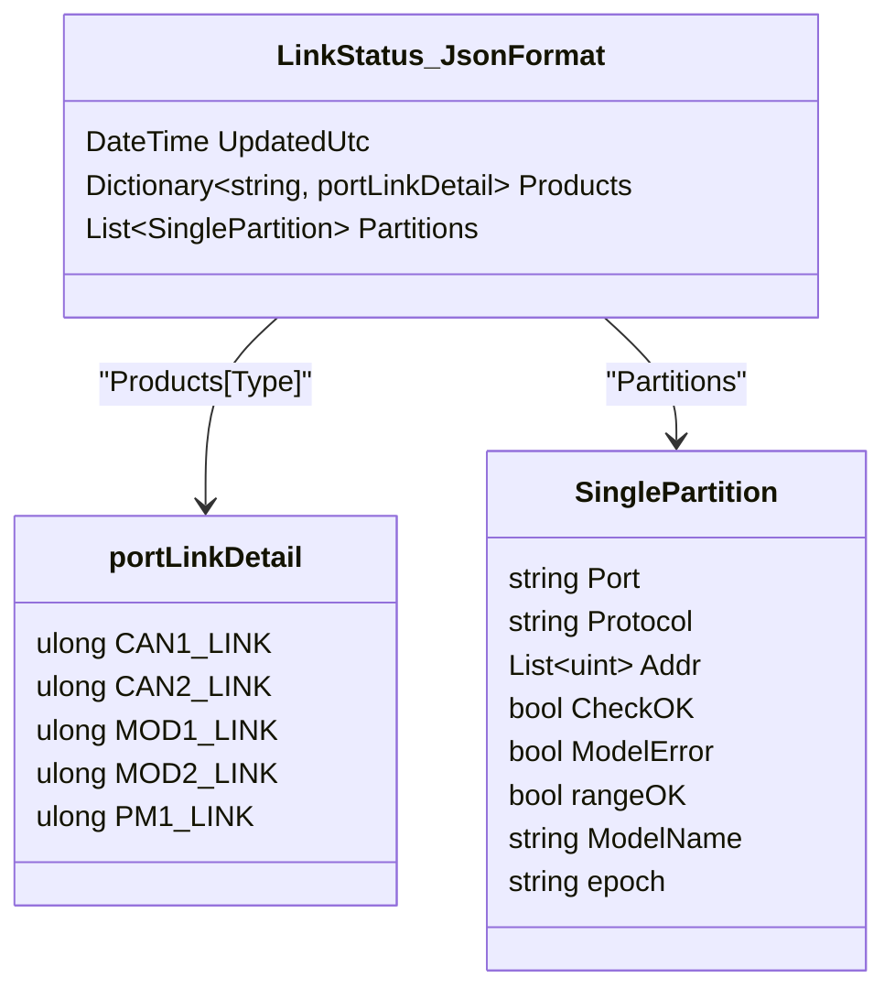
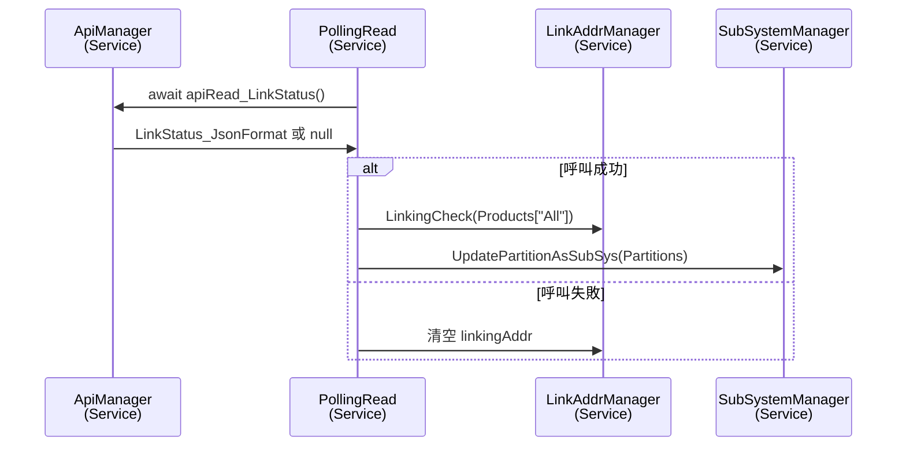

# Link Status API 使用流程
> Link_Status_API 在 "API使用說明文件" 中稱為 「系統總狀態」。

以下以 `ApiManager.apiRead_LinkStatus` 為例，整理從資料模型定義、API 函式實作、到服務端使用此函式的完整鏈路。

---

## 1. 定義回傳資料模型

### 類別與欄位對應



- `LinkStatus_JsonFormat` 對應 API JSON 根節點。
  - `Products` 是一個以字串為 key 的字典；每個 value (`portLinkDetail`) 使用 `HexToUlongConverter` 將 0xHEX 字串轉成 `ulong` 位元旗標。
  - `Partitions` 描述子系統資訊，以 `SinglePartition` 物件列表表達。
- `SinglePartition` 內含 port、protocol、屬於該分區的 addr 集合，以及檢查結果與 `epoch` 用來判斷 SubSystem 的 Range 是否更新。

---

## 2. 在 ApiManager 中實作呼叫函式

`demoVer/Services/ApiProcessor.cs`

```csharp
public async Task<LinkStatus_JsonFormat?> apiRead_LinkStatus()
{
    try
    {
        string url = $"api/memory/link-status";
        var result = await _http.GetFromJsonAsync<LinkStatus_JsonFormat>(url);
    
        if(result == null)
        {
            throw new Exception($"[apiRead_LinkStatus] Read_API_JSON == null");
        }
        return result;
    }
    catch(HttpRequestException ex)
    {
        AppLogger.Log_To_File_log(_category, $"[ApiManager][apiRead_LinkStatus] Http_Error: {ex}", AppLogLevel.Debug);
        return null;
    }
    catch(Exception ex)
    {
        AppLogger.Log_To_File_log(_category, $"[ApiManager][apiRead_LinkStatus] Error: {ex}", AppLogLevel.Debug);
        return null;
    }
}
```

- 使用命名的 `HttpClient` (`ApiClient`) 透過 `GetFromJsonAsync<LinkStatus_JsonFormat>` 直接反序列化為上述模型。
- 若 HTTP 層或反序列化失敗，回傳 `null` 並寫入 Log；呼叫端需自行判斷是否重試或進行斷線處理。

---

## 3. 實際使用案例：PollingRead.PollNowLinkAddr

`demoVer/Services/PollingRead.cs`

```csharp
rcv_linkStatus = await _apiManager.apiRead_LinkStatus();
if(rcv_linkStatus is null)
{
    PollingNowLink_isSucc = false;
    linkingAddr.Clear();
}
else
{
    var INV_products = rcv_linkStatus.Products["All"];
    LinkingCheck(INV_products);        // 更新 linkingAddr 集合

    var partitions = rcv_linkStatus.Partitions;
    UpdatePartitionAsSubSys(partitions); // 同步 SubSystem Manager
}
```

- 呼叫 `apiRead_LinkStatus()` 取得 `LinkStatus_JsonFormat`。
- 成功時，`Products["All"]` 透過 `LinkingCheck` 解析位元旗標，更新目前的連線設備集合。
- `Partitions` 交由 `UpdatePartitionAsSubSys` 將子系統設定同步到 `_subSystemManager`，並依 `epoch` 決定是否需要進一步抓取設定範圍或寫入命令資訊。
- 失敗時，清空 `linkingAddr` 。

---

## 4. 呼叫流程摘要



這份流程展示了從資料結構設計、HTTP 呼叫實作，到消費端如何解析資料並更新系統狀態的完整時序。實作其他 API 時可參考此模式：
1. 先定義對應資料模型。
2. 在 `ApiManager` 實作序列化與錯誤處理。
3. 在服務或元件中注入 `ApiManager` 並使用回傳資料。
