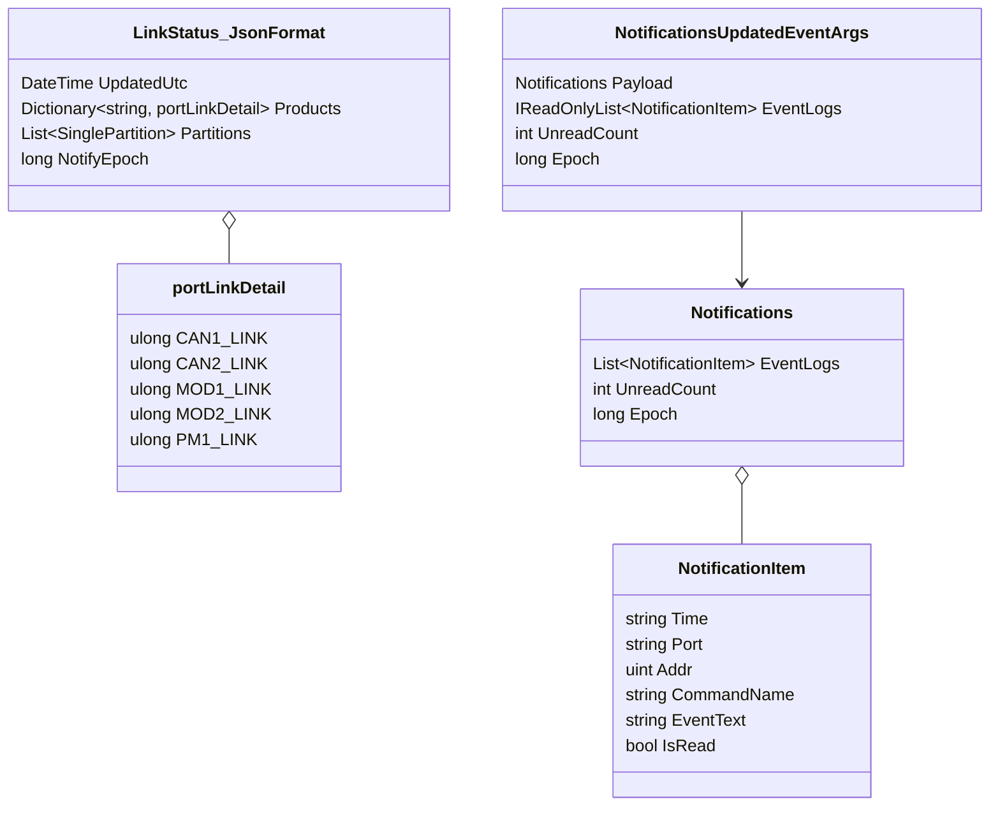
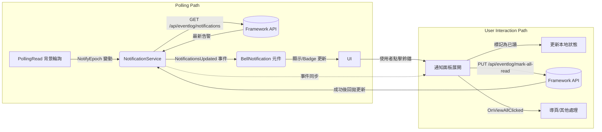

# BellNotification 整合說明

## 概覽
- `BellNotification` 為頂部工具列的告警提醒按鈕，來源檔案：`demoVer/Components/Shared/NotifyBell/BellNotification.razor`
- 告警資料由 `NotificationService` 管理並透過事件推送至 UI
- 告警清單由 Framework API 傳回，使用 `ApiManager` 的封裝方法進行呼叫
- `PollingRead` 背景工作者負責偵測 `NotifyEpoch` 是否變動，驅動整體刷新流程

## 主要參與元件
| 元件 | 位置 | 職責 |
| --- | --- | --- |
| `BellNotification` | `demoVer/Components/Shared/NotifyBell/BellNotification.razor` | 呈現 Badge、清單、處理使用者互動並發布「全部已讀」請求 |
| `NotificationService` | `demoVer/Services/NotificationService.cs` | 緩存最新告警、觸發背景刷新、管理與 API 之間的互動與併發控制 |
| `ApiManager` | `demoVer/Services/ApiProcessor.cs` | 提供 `apiRead_eventLog_Notify` 與 `apiPut_eventLog_MarkAsRead` 等 API 呼叫介面 |
| `PollingRead` | `demoVer/Services/PollingRead.cs` | 定期呼叫 `apiRead_LinkStatus`，當 `NotifyEpoch` 變動時要求 `NotificationService` 重抓告警 |
| `Notifications` / `NotificationItem` | `demoVer/Models/Notification/Notification.cs` | 序列化 API 回傳的告警資料模型 |

## 告警資料流
1. `PollingRead` 以背景工作者方式執行，輪詢 `GET /api/memory/link-status`。模型 `LinkStatus_JsonFormat` 中的 `NotifyEpoch` 字段代表告警資料版本號。
2. 當 `NotifyEpoch` 與 `NotificationService` 緩存的值不同時，呼叫 `NotificationService.CheckEpoch(newEpoch)`。
3. `NotificationService` 使用 `_refreshGate` 防止重入，透過 `ApiManager.apiRead_eventLog_Notify()` 非同步抓取最新告警 (`GET /api/eventlog/notifications`)。
4. 呼叫成功後更新 `LastNotifications` 與未讀計數，並發出 `NotificationsUpdated` 事件，所有訂閱者 (包含 `BellNotification`) 會同步更新。
5. 使用者展開通知面板時，元件內部先將本地項目標記為已讀，並呼叫 `NotificationService.Mark_AllEventLogs_AsRead()`。
6. `NotificationService` 以 `_markReadGate` 保護 PUT 請求，使用 `ApiManager.apiPut_eventLog_MarkAsRead()` 呼叫 `PUT /api/eventlog/mark-all-read`，成功後重拋 `NotificationsUpdated` 事件，確保其他 UI 同步變化。

## 資料模型


- `LinkStatus_JsonFormat` / `portLinkDetail` 定義於 `demoVer/Models/Sys_Setting/Link_Status.cs`，`NotifyEpoch` 為告警資料版本，其他欄位提供輪詢設備資訊。
- `Notifications` / `NotificationItem` 位於 `demoVer/Models/Notification/Notification.cs`，直接對應 `/api/eventlog/notifications` 回傳結構。
- `NotificationsUpdatedEventArgs` 在 `demoVer/Services/NotificationService.cs`，將最新 `Notifications` 包裝成事件參數供 UI 訂閱者存取 `EventLogs` 與 `UnreadCount`。

## API 詳細資訊
| API | 方法 | 呼叫端 | 回傳內容 |
| --- | --- | --- | --- |
| `/api/memory/link-status` | GET | `PollingRead` | `LinkStatus_JsonFormat`，包含 `notifyEpoch`、連線設備資訊等 |
| `/api/eventlog/notifications` | GET | `NotificationService.TriggerEventLogRefresh()` | `Notifications`，內含 `eventLogs`, `unreadCount`, `epoch` |
| `/api/eventlog/mark-all-read` | PUT | `NotificationService.Mark_AllEventLogs_AsRead()` | 無內容 (布林表示成功與否) |

### `Notifications` JSON 範例
```json
{
  "eventLogs": [
    {
      "time": "2025-12-08T14:56:11Z",
      "port": "CAN1",
      "addr": 1,
      "commandName": "READ_FAULT",
      "eventText": "模組溫度過高",
      "isRead": false
    }
  ],
  "unreadCount": 1,
  "epoch": 639007557391793960
}
```

### `NotificationItem` 欄位意義
- `time`：事件時間字串 (後端格式化)
- `port`：來源通道 (如 CAN1、MOD1 等)
- `addr`：裝置位址 (數值)
- `commandName`：對應的命令名稱或識別
- `eventText`：實際顯示文字
- `isRead`：是否已讀 (Framework 端回填)

## UI 行為說明 (`BellNotification.razor`)
- Badge 顯示 `UnreadCount`, 超過 99 以 `99+` 呈現 (`UnreadCountLabel`)
- 初始化 (`OnInitialized`) 時會用 `NotificationService.LastNotifications` 填充 UI 並註冊事件訂閱
- 展開面板時：
  - `notificationsOpen` 置為 `true`
  - 逐一將清單項目 `IsRead = true`
  - 呼叫 `NotificationService.Mark_AllEventLogs_AsRead()` 通知伺服器
- 點擊任一項目會觸發 `MarkAsReadAndClose()` 收合面板 (後續跳轉可透過外層決定)
- 「查看全部」按鈕 (`ViewAll`) 透過 `EventCallback OnViewAllClicked` 讓外層元件決定導頁或其他行為 (例如 `TopRow.razor` 中使用 `GoTo_Log`)

## 整合步驟
1. **確認服務註冊**：`Program.cs` 已註冊 `NotificationService`, `ApiManager`, `PollingRead` (作為 HostedService)。若為新專案需在 `builder.Services` 中加入相同設定。
2. **引入命名空間**：確保頁面或佈局有 `@using demoVer.Shared` (預設由 `Components/_Imports.razor` 提供)，即可直接使用 `<BellNotification />`。
3. **放置元件**：於頂部列或其他 UI 容器加上 `<BellNotification OnViewAllClicked="..." />`，例如 `demoVer/Components/Shared/TopRow/TopRow.razor`。
4. **處理回呼**：實作 `OnViewAllClicked`，常見作法是導向監測報告頁或開啟專用視窗。
5. **樣式客製**：通知面板樣式在 `demoVer/Components/Shared/NotifyBell/BellNotification.razor.css`。若需覆寫請留意 `.bell-btn`, `.notifications-dropdown` 等類別。
6. **多語系字串**：所有標題、提示字串存放於 `demoVer/Resources/SharedResource.*.resx`。新增語系時請同步更新對應鍵值 (例如 `BellNotification-Title`)。

## Mermaid 流程圖


## 驗證與排錯建議
- 觀察 `demoVer/ProgramLog/log.json` 或框架記錄檔確認 API 呼叫是否成功 (`Link Status NotifyEpoch changed...`)
- 若沒有 badge 數字，請確認 `PollingRead` 是否有被註冊為 HostedService 並能取得 `NotifyEpoch`
- API 錯誤時 `NotificationService` 會寫入 `AppLogger` (等級 `Trace`/`Debug`)，可根據 `_category` 篩選 `NotificationService` 相關訊息

## 延伸應用
- 其他元件亦可訂閱 `NotificationService.NotificationsUpdated` 以獲得同樣資料
- 可於 `BellNotification` 透過 `OnViewAllClicked` 導向自訂監測報表或打開 Modal，保持現有服務邏輯不變
- 若需新增「單筆標記已讀」功能，可在 `NotificationService` 增加對應 API 呼叫並在元件內觸發
