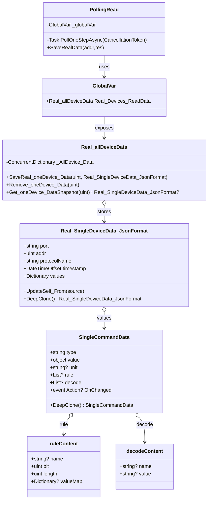

# PollingRead Data Structure Overview

## Relationships

- `PollingRead` writes single-device snapshots via `_globalVar.Real_Devices_ReadData.SaveReal_oneDevice_Data(addr, res)` and removes them with `Remove_oneDevice_Data` when data is invalid.
- `Real_allDeviceData` stores each device in a `ConcurrentDictionary<uint, Real_SingleDeviceData_JsonFormat>`, locking individual entries during updates to avoid concurrent writes.
- `Real_SingleDeviceData_JsonFormat` keeps per-device metadata and a `values` map keyed by command name, each entry being a `SingleCommandData` instance.
- `SingleCommandData` tracks command type, value, unit, decoded detail, and change notifications; supporting types `ruleContent` and `decodeContent` hold auxiliary metadata.

