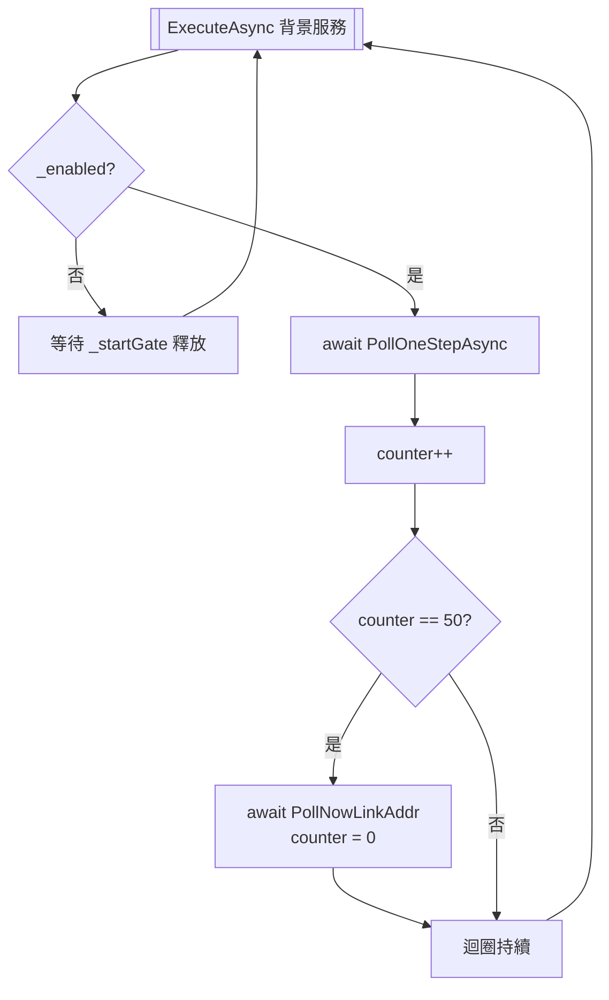
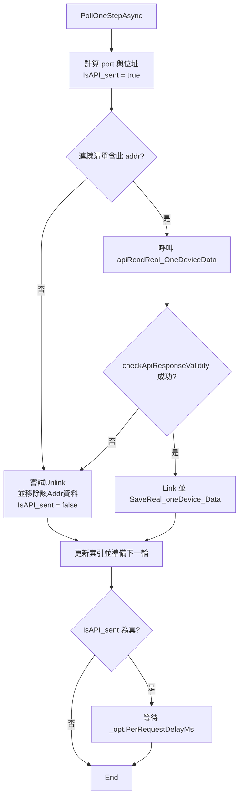
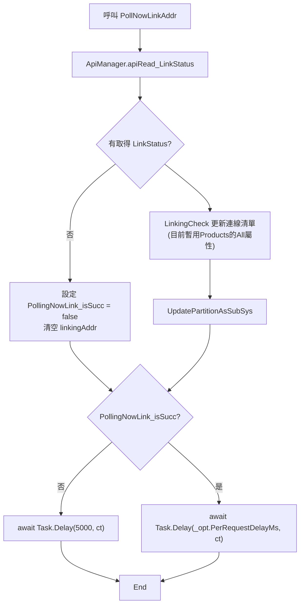

# PollingRead流程圖
下列圖示與說明整理 `PollingRead` 背景服務如何循環呼叫 `ApiManager` (原 ApiProcessor) 以及最終寫入 `_globalVar.Real_Devices_ReadData` 的流程，並補充每個階段的關鍵細節與錯誤處理。所有內容以程式目前的實作為基礎。

---

## 目錄
- [排程迴圈概觀](#排程迴圈概觀)
- [單次輪詢 (PollOneStepAsync) 詳細流程](#單次輪詢-pollonestepasync-詳細流程)
- [PollNowLinkAddr 詳細流程](#pollnowlinkaddr-詳細流程)
- [其他重要互動](#其他重要互動)

## 排程迴圈概觀

**說明**
- 背景服務會先等待外部呼叫 `EnableAsync`，才會開始真正的輪詢。
- 每完成 50 次 `PollOneStepAsync` 後觸發 `PollNowLinkAddr`，透過 `ApiManager.apiRead_LinkStatus()` 重取連線裝置清單。
- `PollOneStepAsync` 成功時會從框架取得該addr的所有命令資訊並儲存；失敗則刪除該addr的所有命令資訊
- `PollNowLinkAddr` 成功時會從框架同步連線資訊。失敗則延遲 5 秒再試，避免伺服器過於忙碌。主要負責以下兩件工作。
    1. 進行_links(連線Addr清單)更新。
    2. 進行SubSystem資訊更新(port, protocol, Ranges...等)
    

---

## 單次輪詢 (`PollOneStepAsync`) 詳細流程

**說明**
- `linkingAddr` 是 `PollNowLinkAddr` 最新取得的連線快照，代表目前仍在線上的設備。
- 若位址不在快照內，直接呼叫 `_linkAddrManager.Unlink()` 與 `_globalVar.Real_Devices_ReadData.Remove_oneDevice_Data()` 清除該addr資料。
- 呼叫 `apiReadReal_OneDeviceData()` 失敗 (null 或 `HttpRequestException`) 時，也依照斷線處理路徑清理資料。
- `checkApiResponseValidity()` 目前主要檢查明緯設備的 `MFR_MODEL` 等欄位，確保資料可信；無效資料同樣走移除流程。
- 資料有效時會：
  1. 更新 Link 狀態 (`_linkAddrManager.Link(nowStoringAddr)`)；
  2. 將讀回的 `Real_SingleDeviceData_JsonFormat` 存入 `_globalVar.Real_Devices_ReadData`。

---
## PollNowLinkAddr 詳細流程

**說明**
- `reqCts.CancelAfter(_opt.RequestTimeoutMs)` 確保單次 Link Status 呼叫超時可中止，不會卡住輪詢執行緒。
- 成功取得資料後，`LinkingCheck` 將 `rcv_linkStatus.Products["All"]` 轉成新的 `linkingAddr` 集合，同步更新至 `_linkAddrManager` 使用的連線設備清單。
- `UpdatePartitionAsSubSys` 會比對 `Partitions`：在LinkStatus API回傳中，新增存在的partition作為SubSystem，移除不在的Partition(SubSystem)，若某個 `partition` 的 `epoch` 變化則觸發背景更新設定範圍與可調整之命令資訊。
- 若 API 回傳 `null` 或發生例外，`linkingAddr` 會被清空並延遲 5 秒後重試；正常情況則以 `_opt.PerRequestDelayMs` 控制Delay時長。

---

## 其他重要互動

- `PollNowLinkAddr` 的結果會寫入 `_linkAddrManager` ，且會用 `_subSystemManager` 驗證/刪除不存在的 SubSystem、更新設定範圍。
- `_opt.PerRequestDelayMs` 為節流控制：只有當 API 實際發出 (IsAPI_sent == true) 才等待，避免無效位址造成不必要延遲。
- `ReqTimeoutMs` 透過 `CancellationTokenSource.CancelAfter()` 對單次 API call 設定 timeout，避免背景工作長時間卡住。
- `_globalVar.Real_Devices_ReadData` 的快照方法 (`Get_oneDevice_DataSnapshot`、`Get_oneDevice_CmdData_Ref`) 供 UI 或 SignalR Hub 使用，確保讀取端拿到的是 thread-safe 的複本或唯讀參考。

---